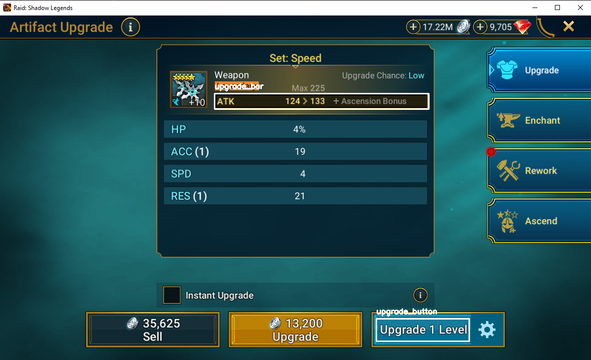

# Raid Autoupgrade

A command-line tool to help doing the "airplane" mode trick semi-automatically. It can caount failed upgrades and stop and upgrade after a set amount of fails.

## Usage

To count the amount of fails a piece need to be upgraded:

1. Within raid go to the upgrade menu of the piece.
2. Disable all network adapters.
3. Run the command `raid-autoupgrade count`.
4. A screenshot of the raid application will now pop up. Dragselect a rectangle encompassing the upgrade bar. It is important that we only include the upgrade bar and not too much around it. See image below. for example placement.
5. Again a screenshot of the raid application will pop up. Dragselect a rectangle within the upgrade button. See image below for example placement.

6. The upgrade will now start and the amount of fails will be counted. Make a note of the amount of fails it detects, we will call it here `n_fails`.

To spend upgrades:
1. Turn on network.
2. Go to the upgrade screen of a piece we want to spend upgrades on.
3. Run the command `raid-autoupgrade count --max-fails <n_fails-1>`. Note that we will set max fails to one less, since the tool tends to stop one upgrade too late.
4. Now there are two scenarios:
    <ol type="a">
    <li>The piece upgrades, but we have not reached the amount of fails. In that case continue from step 2 until we have reached `n_fails`. When starting the command in step 3 make sure to adjust `--max-fails` and take into account that the upgrade itself also spends an upgrade attempt.</li>
    <li>We have reached `n_fails`. Then we can upgrade the original piece.</li>
    </ol>

``

You might want to record the upgrade bar and upgrade button before starting the count to make sure everything is correct. This can be done with `raid-autougprade select-regions`. As long as the size of the window does not change (and the script is run from the same folder), the regions will be saved and used in the `count` command.

You can nspect and see whether the regions have been marked correclty by calling `raid-autoupgrade show-regions`. Then an image similar to the one above will pop up.

Too see all commands run `raid-autoupgrade --help` on each command.

## Limitations and Considerations
* The raid window will force itself to the foreground. This makes workign on something on the same monitor a bit difficult.
* The upgrade will sometimes count one too many when waiting for connection timeout.
* If you are running RSLHelper you need to run the script as administrator. This is due to raid being started as administrator.
* While the command runs make sure not to change the window size of the raid application.
* A cache folder will be generated in the folder in which the command is called.

## TODO

Unordered roadmap:
* Make UI which can start from a bat file.
* If spending upgrades on a piece that is level 10, make it possible to start an upgrade after it has upgraded once to continue spending upgrade attempts.
* Add ability to turn off and on internet.
* Make it possible to have the raid window in the background.
    - Enable background screenshot
    - Enable background clicking
