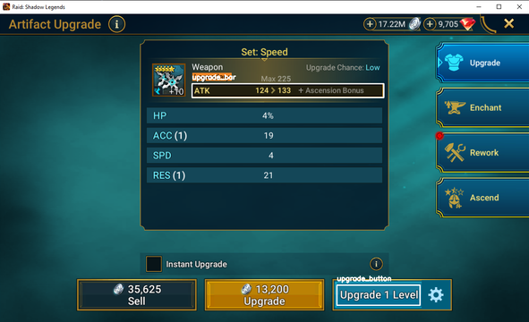

# AutoRaid

A Windows desktop tool to automate the "airplane mode trick" for gear upgrades in Raid: Shadow Legends. AutoRaid uses computer vision to count failed upgrade attempts offline, then automatically spends those attempts on another piece to save silver.

> **⚠️ WARNING**: This tool automates gameplay and **may violate Raid: Shadow Legends' Terms of Service**. Use at your own risk. Read the full [DISCLAIMER](DISCLAIMER.md) before using.

**New to the airplane mode trick?** See [How It Works](docs/airplane-mode-trick.md) for a detailed explanation.

## Quick Start

1. **Launch the GUI**:
   ```bash
   uv run autoraid gui
   ```

2. **Calibrate regions** (whenever the Raid window is resized):
   - Navigate to the upgrade screen in Raid
   - Open the **Calibration tab**, click **Capture Screenshot**, then draw regions over the upgrade progress bar and upgrade button
   - Regions are saved and reused across sessions — recalibrate if the window size changes

   

3. **Select network adapters** (one-time):
   - In the **Run tab**, use the Network sidebar to choose which adapters to disable during counting (Wi-Fi, Ethernet, etc.)

4. **Run an upgrade**:
   - Navigate to the upgrade screen of the gear piece to count fails on
   - In the **Count panel**, click **Start Count** — network is disabled automatically while counting
   - Navigate to the upgrade screen of the gear piece to spend upgrades on
   - In the **Spend panel**, click **Start Spend** — max attempts is auto-populated from the count
   - Enable **Continue Upgrade** in the Spend panel for level 10 gear to upgrade to level 12 if required

## Important Notes

- **Windows only**: Uses WMI for network adapter control
- **Administrator rights**: Required for WMI network adapter control
- **Window size**: Keep Raid window size constant (regions cached per window size)
- **Foreground window**: Raid window will activate and grab focus during operation
  - Hard multitask while tool is running (window repeatedly takes focus for screenshots and clicks)
  - May briefly minimize/restore raid window
- **First-try success**: Tool might have issues with upgrades that succeed on first attempt
- **Cache folder**: Creates `cache-raid-autoupgrade/` in working directory

## License & Disclaimer

**License**: Personal use only. See [LICENSE](LICENSE) for full terms.

**Legal**: See [DISCLAIMER.md](DISCLAIMER.md) for important legal information regarding use of this tool.
