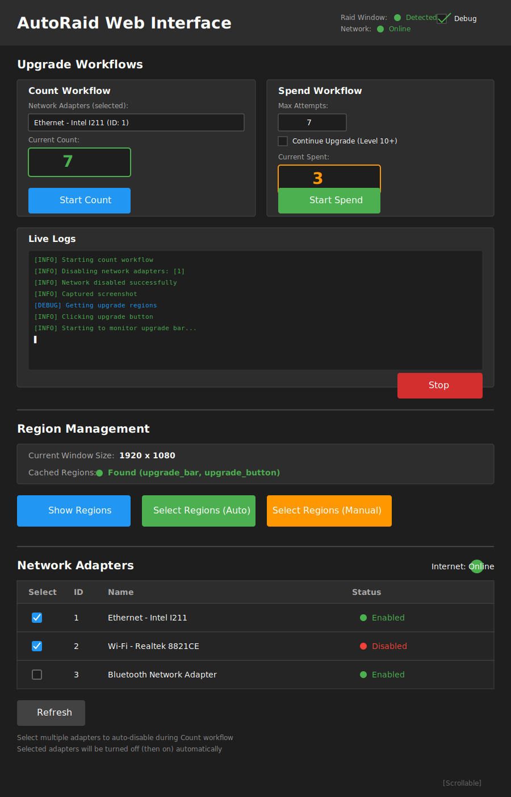

# Feature Specification: AutoRaid GUI Desktop Application

**Feature Branch**: `003-gui-desktop-app`
**Created**: 2025-10-18
**Status**: Draft
**Input**: User description: "A functional description can be found in plans/gui-functional.md. We are not following a strict TDD design, but rather use smoke tests."

## User Scenarios & Testing *(mandatory)*

### User Story 1 - Count Upgrade Fails with Airplane Mode (Priority: P1)

A user wants to determine how many upgrade attempts are needed before a successful upgrade by using the "airplane mode trick" (network disabled). They navigate to the GUI, select network adapters to disable, start the count workflow, and watch real-time feedback as the tool counts failed upgrade attempts.

**Why this priority**: This is the core workflow that enables the airplane mode trick - the primary reason users need AutoRaid. Without this, the tool has no value.

**Independent Test**: Can be fully tested by launching the GUI, selecting network adapters, clicking "Start Count", and verifying the count increments while network is disabled. Delivers immediate value by showing exact number of fails needed.

**Acceptance Scenarios**:

1. **Given** Raid is running with an upgradeable gear piece, **When** user selects network adapters and clicks "Start Count", **Then** network adapters are disabled, upgrade button is clicked repeatedly, and fail count increments in real-time
2. **Given** count workflow is running, **When** gear successfully upgrades (4 consecutive standby states detected), **Then** workflow stops, network adapters re-enable, and final count displays
3. **Given** count workflow is running, **When** user clicks "Stop" button, **Then** workflow cancels immediately, network adapters re-enable, and toast notification shows "Workflow cancelled"
4. **Given** no network adapters selected, **When** user clicks "Start Count", **Then** toast notification shows error message and workflow does not start

---

### User Story 2 - Spend Counted Attempts with Network On (Priority: P2)

After counting upgrade fails, a user wants to spend those attempts with network enabled to guarantee an upgrade at the right time. They navigate to the Spend section, see the max attempts auto-populated from the previous count, click "Start Spend", and watch as the tool uses those attempts to upgrade the gear.

**Why this priority**: This completes the airplane mode trick workflow. Without Spend, users must manually perform the counted attempts, defeating the purpose of automation.

**Independent Test**: Can be fully tested by manually setting max attempts, clicking "Start Spend", and verifying the tool clicks upgrade button the specified number of times with network on. Delivers value by automating the repetitive clicking.

**Acceptance Scenarios**:

1. **Given** max attempts is set (e.g., 5), **When** user clicks "Start Spend", **Then** tool clicks upgrade button 5 times, counts successful upgrades, and displays result (n_upgrades, n_attempts, n_remaining)
2. **Given** last count workflow completed with n_fails=8, **When** user navigates to Spend section, **Then** "Max Attempts" field auto-populates with 8
3. **Given** spend workflow running with "Continue Upgrade" enabled, **When** first upgrade succeeds and gear is level 10+, **Then** tool automatically starts next upgrade without user intervention
4. **Given** no internet access detected, **When** user clicks "Start Spend", **Then** toast notification shows "No internet access detected. Aborting." and workflow does not start

---

### User Story 3 - Select UI Regions for Detection (Priority: P1)

A user launching AutoRaid for the first time (or after Raid window resize) needs to define which regions of the Raid window to monitor. They click "Select Regions (Auto)" to attempt automatic detection, or "Select Regions (Manual)" to manually draw regions, then see visual confirmation of cached regions.

**Why this priority**: Region selection is a prerequisite for all upgrade workflows. Without regions, the tool cannot detect upgrade states. This must be P1 to enable P1 workflows.

**Independent Test**: Can be fully tested by clicking "Select Regions (Auto/Manual)", drawing regions in OpenCV window, and verifying status updates show cached region names. Delivers value by enabling all detection workflows.

**Acceptance Scenarios**:

1. **Given** Raid window is running, **When** user clicks "Select Regions (Auto)", **Then** tool attempts automatic detection and either succeeds (shows cached regions) or falls back to manual selection
2. **Given** manual region selection initiated, **When** user draws ROIs for upgrade bar, button, and artifact icon, **Then** regions are cached and status display updates with region names
3. **Given** regions are cached for window size 1920x1080, **When** Raid window is resized to 1280x720, **Then** warning banner appears indicating cached regions are invalid and user must re-select
4. **Given** no cached regions exist, **When** user clicks "Start Count" or "Start Spend", **Then** toast notification shows "No cached regions found. Please select regions first." and scroll to Region Management section

---

### User Story 4 - Manage Network Adapters (Priority: P2)

A user wants to control which network adapters are automatically disabled during the count workflow. They scroll to the Network Adapters section, see a table of all adapters with current status, select adapters via checkboxes, and optionally manually enable/disable adapters to test connectivity.

**Why this priority**: While essential for Count workflow, this is P2 because users can manually disable network (Windows settings) if needed. GUI provides convenience, not critical functionality.

**Independent Test**: Can be fully tested by selecting adapters via checkboxes, clicking enable/disable buttons, and verifying status changes. Delivers value by simplifying network control without leaving the app.

**Acceptance Scenarios**:

1. **Given** GUI is launched, **When** user scrolls to Network Adapters section, **Then** table displays all network adapters with columns: ID, Name, Status (enabled/disabled)
2. **Given** user selects 2 adapters via checkboxes, **When** user navigates to Count section, **Then** selected adapter names display in read-only field
3. **Given** selected adapters persisted in storage, **When** user restarts application, **Then** checkboxes remain checked for previously selected adapters
4. **Given** user clicks "Refresh" button, **When** button is clicked, **Then** adapter table reloads and displays updated status for all adapters

---

### User Story 5 - Monitor Workflows with Real-Time Logs (Priority: P3)

A user running upgrade workflows wants to see detailed, real-time logs to understand what the tool is doing and diagnose issues. They monitor the shared log area at the bottom of the Upgrade Workflows section and see color-coded log messages appearing as the workflow executes.

**Why this priority**: P3 because workflows can succeed without visible logs - the count/spent fields provide key feedback. Logs enhance transparency and debugging but aren't critical for basic operation.

**Independent Test**: Can be fully tested by starting any workflow and verifying logs appear in real-time with correct color coding (INFO=green, ERROR=red, etc.). Delivers value by improving user confidence and troubleshooting capability.

**Acceptance Scenarios**:

1. **Given** count workflow is running, **When** progress bar state changes from standby to progress, **Then** log entry appears: "Progress bar state: progress" (color: green)
2. **Given** logs are displayed from previous workflow, **When** user starts new workflow, **Then** log area clears before displaying new logs
3. **Given** 50 log entries exceed visible area, **When** new log entry appears, **Then** log area auto-scrolls to show latest entry
4. **Given** error occurs (e.g., window not found), **When** exception is raised, **Then** log entry appears in red with error message

---

### User Story 6 - Enable Debug Mode for Troubleshooting (Priority: P3)

A user encountering issues with upgrade detection wants to save debug artifacts (screenshots, metadata, ROI images) to diagnose the problem. They toggle the Debug checkbox in the header, run a workflow, and access saved artifacts from the file system.

**Why this priority**: P3 because debug mode is only needed when workflows fail unexpectedly. Most users never need this - it's for power users and maintainers.

**Independent Test**: Can be fully tested by enabling debug checkbox, running count workflow, and verifying debug artifacts exist in `cache-raid-autoupgrade/debug/` directory. Delivers value by enabling detailed post-mortem analysis.

**Acceptance Scenarios**:

1. **Given** debug checkbox is unchecked, **When** user runs count workflow, **Then** no debug artifacts are saved
2. **Given** debug checkbox is checked, **When** user runs count workflow, **Then** screenshots, progress bar ROIs, and metadata JSON are saved to debug directory with timestamps
3. **Given** debug mode enabled in previous session, **When** user restarts application, **Then** debug checkbox remains checked (persisted state)

---

### User Story 7 - View Cached Region Status (Priority: P3)

A user wants to verify that UI regions are properly cached and see which regions are available before starting workflows. They navigate to Region Management section and see current window size, list of cached region names, and click "Show Regions" to see annotated screenshot.

**Why this priority**: P3 because region selection (P1) already provides visual confirmation. This adds convenience for verification but isn't critical for operation.

**Independent Test**: Can be fully tested by caching regions, navigating to Region Management, and clicking "Show Regions" to see annotated screenshot. Delivers value by providing visual confirmation without re-selecting.

**Acceptance Scenarios**:

1. **Given** regions are cached, **When** user navigates to Region Management section, **Then** display shows: window size (e.g., "1920x1080"), cached regions (e.g., "upgrade_bar, upgrade_button, artifact_icon")
2. **Given** user clicks "Show Regions" button, **When** button is clicked, **Then** OpenCV window opens displaying full screenshot with colored rectangles highlighting each cached region
3. **Given** Raid window not found, **When** user navigates to Region Management, **Then** warning message displays: "Raid window not found"

---

### Edge Cases

- **What happens when user resizes Raid window during workflow?** Workflow continues with stale regions, likely fails, shows error toast. User must re-select regions and restart workflow.
- **What happens when user has no network adapters?** Network Adapters section shows empty table. Count workflow requires manual airplane mode (Windows settings).
- **What happens when automatic region detection fails?** Tool falls back to manual selection, opens OpenCV ROI selection window for user to draw regions.
- **What happens when user clicks Start Count while Spend workflow is running?** Count button remains disabled - only one workflow can run at a time.
- **What happens when network adapters fail to disable within 3 seconds?** Workflow shows error toast: "Failed to disable network. Check adapter IDs." and aborts.
- **What happens when user closes GUI while workflow is running?** Workflow task is cancelled, network adapters re-enable in finally block (if possible), application closes gracefully.
- **What happens when Raid window closes mid-workflow?** WindowNotFoundException is raised, workflow stops, error toast shows: "Raid window not found. Check if Raid is running."
- **What happens when gear upgrades on first attempt during Count?** Tool does not handle this case (known limitation). User sees unexpected behavior - workflow stops immediately.
- **What happens when user enables "Continue Upgrade" for level 1-9 gear?** Checkbox has no effect - tool only continues for level 10+ gear (checked via OCR).

---

## UI Layout Overview

The following diagram shows the single-page scrollable layout with all three functional sections arranged vertically:

**Layout Structure** (top to bottom):
1. **Header**: Application title, status indicators (Raid window, Network), Debug toggle
2. **Upgrade Workflows Section**: Count (left) + Spend (right) + Live Logs (bottom) - Most frequently used functionality at the top
3. **Region Management Section**: Window size display, cached region status, show/select buttons - Setup functionality in the middle
4. **Network Adapters Section**: Adapter table with multi-select checkboxes, status indicators - Setup functionality at the bottom

**Design Rationale**:
- **Single scrollable page**: All functionality visible without tab switching, providing better overview
- **Vertical flow**: Natural reading order from most-used (upgrades) to setup (network/regions)
- **Visual section dividers**: Clear horizontal lines separate functional areas for easy scanning
- **Compact height (~1400px)**: Fits standard desktop displays with smooth scrolling between sections

---

## Requirements *(mandatory)*

### Functional Requirements

#### GUI Application
- **FR-001**: System MUST provide a native desktop application window (not browser-based) with a single-page scrollable interface
- **FR-002**: System MUST display fixed header bar showing application title, Raid window status (green/red), network status (green/red), and debug mode checkbox
- **FR-003**: System MUST organize content into three vertical sections: Upgrade Workflows (top), Region Management (middle), Network Adapters (bottom)
- **FR-004**: System MUST enable smooth vertical scrolling across all sections (~1400px total height)

#### Count Workflow
- **FR-005**: System MUST provide "Start Count" button that initiates count workflow when clicked
- **FR-006**: System MUST disable selected network adapters before starting count workflow
- **FR-007**: System MUST wait up to 3 seconds for network to turn off after disabling adapters
- **FR-008**: System MUST click upgrade button repeatedly and monitor progress bar color changes every 0.25 seconds
- **FR-009**: System MUST increment "Current Count" field in real-time as fail states are detected
- **FR-010**: System MUST stop count workflow on: max attempts reached, 4 consecutive standby states (upgraded), or 4 consecutive connection_error states
- **FR-011**: System MUST re-enable network adapters after count workflow completes (in finally block)
- **FR-012**: System MUST display selected network adapter names in read-only field within Count section

#### Spend Workflow
- **FR-013**: System MUST provide "Start Spend" button that initiates spend workflow when clicked
- **FR-014**: System MUST validate internet access is available before starting spend workflow
- **FR-015**: System MUST auto-populate "Max Attempts" field with n_fails from last successful count workflow
- **FR-016**: System MUST click upgrade button up to max_attempts times while monitoring upgrade success
- **FR-017**: System MUST increment "Current Spent" field in real-time as attempts are made
- **FR-018**: System MUST display final result showing n_upgrades, n_attempts, n_remaining when workflow completes
- **FR-019**: System MUST support "Continue Upgrade" checkbox that, when enabled, automatically starts next upgrade after success (level 10+ gear only)
- **FR-020**: System MUST use OCR to detect artifact level and only continue upgrade if level >= 10

#### Region Management
- **FR-021**: System MUST display current Raid window size (width x height) in Region Management section
- **FR-022**: System MUST display cached region status showing which regions are cached (upgrade_bar, upgrade_button, artifact_icon)
- **FR-023**: System MUST provide "Show Regions" button that opens OpenCV window displaying annotated screenshot with cached regions highlighted
- **FR-024**: System MUST provide "Select Regions (Auto)" button that attempts automatic region detection and falls back to manual selection on failure
- **FR-025**: System MUST provide "Select Regions (Manual)" button that opens OpenCV ROI selection interface for user to draw regions
- **FR-026**: System MUST cache selected regions in diskcache tied to current window size
- **FR-027**: System MUST display warning banner when Raid window size changes (invalidates cached regions)
- **FR-028**: System MUST show toast notification if workflow starts without cached regions, scrolling to Region Management section

#### Network Adapter Management
- **FR-029**: System MUST display table of all network adapters with columns: ID, Name, Status (enabled/disabled)
- **FR-030**: System MUST provide checkbox per adapter row for multi-select
- **FR-031**: System MUST persist selected adapter IDs across application restarts using app.storage.user
- **FR-032**: System MUST display internet status indicator (green = online, red = offline) at top of Network Adapters section
- **FR-033**: System MUST provide "Refresh" button that reloads adapter table with updated status
- **FR-034**: System MUST allow users to manually enable/disable individual adapters

#### Real-Time Feedback
- **FR-035**: System MUST stream logs in real-time to shared log area at bottom of Upgrade Workflows section
- **FR-036**: System MUST color-code log entries by level: INFO=green, DEBUG=blue, WARNING=yellow, ERROR=red
- **FR-037**: System MUST auto-scroll log area to show latest entry
- **FR-038**: System MUST clear log area when new workflow starts
- **FR-039**: System MUST disable "Start Count" and "Start Spend" buttons while respective workflows are running
- **FR-040**: System MUST provide "Stop" button that cancels running workflow and re-enables network adapters

#### Debug Mode
- **FR-041**: System MUST provide debug mode checkbox in header that toggles debug artifact saving
- **FR-042**: System MUST save debug artifacts (screenshots, progress bar ROIs, metadata JSON) to `cache-raid-autoupgrade/debug/` when debug mode enabled
- **FR-043**: System MUST persist debug mode state across application restarts
- **FR-044**: System MUST log debug artifact save locations to log area

#### Error Handling
- **FR-045**: System MUST show toast notification when Raid window not found: "Raid window not found. Check if Raid is running."
- **FR-046**: System MUST show toast notification when network adapter disable fails: "Failed to disable network. Check adapter IDs."
- **FR-047**: System MUST show toast notification when no cached regions exist: "No cached regions found. Please select regions first."
- **FR-048**: System MUST show toast notification when internet detected during count: "Internet access detected and network ID not specified. This will upgrade the piece. Aborting."
- **FR-049**: System MUST show toast notification when no internet detected during spend: "No internet access detected. Aborting."
- **FR-050**: System MUST show toast notification when workflow cancelled: "Workflow cancelled"

#### Tooltips and Help
- **FR-051**: System MUST display tooltips on hover (500ms delay) for all input fields and buttons
- **FR-052**: System MUST position tooltips near hovered element with light gray background and dark text

#### Keyboard Shortcuts
- **FR-053**: System MUST cancel running workflow when Esc key pressed (equivalent to Stop button)
- **FR-054**: System MUST submit focused form when Enter key pressed (Start Count, Start Spend)

#### Data Persistence
- **FR-055**: System MUST persist selected network adapter IDs across application restarts
- **FR-056**: System MUST persist last count result (n_fails) for auto-populating Max Attempts field
- **FR-057**: System MUST persist debug mode enabled/disabled state across application restarts
- **FR-058**: System MUST reset Current Count and Current Spent values on application restart
- **FR-059**: System MUST use existing diskcache implementation for region caching (same as CLI)

### Key Entities

- **Network Adapter**: Represents a Windows network interface with ID, Name, and Status (enabled/disabled). Users select adapters to auto-disable during Count workflow.
- **Cached Region**: Represents a UI detection region (upgrade_bar, upgrade_button, artifact_icon) with coordinates (left, top, width, height) relative to Raid window. Tied to window size and persisted in diskcache.
- **Workflow State**: Represents the execution state of Count or Spend workflows including current count/spent, running status, and final results (n_upgrades, n_attempts, n_remaining).
- **Debug Artifact**: Represents saved debug files including screenshots, progress bar ROI images, and metadata JSON with timestamps and state information.
- **Log Entry**: Represents a single log message with level (INFO/DEBUG/WARNING/ERROR), timestamp, and message text. Streamed to GUI log area in real-time.

## Success Criteria *(mandatory)*

### Measurable Outcomes

- **SC-001**: Users can complete Count workflow (select adapters, start count, receive result) in under 2 minutes
- **SC-002**: Users can complete Spend workflow (set max attempts, start spend, receive result) in under 1 minute
- **SC-003**: Users can select UI regions (auto or manual) in under 1 minute on first launch
- **SC-004**: GUI displays real-time count/spent updates with less than 500ms latency from actual state change
- **SC-005**: Network adapters re-enable within 3 seconds of workflow completion or cancellation 100% of the time
- **SC-006**: Users successfully complete primary task (Count + Spend workflow) on first attempt 90% of the time
- **SC-007**: Application launches and displays main window within 5 seconds on standard hardware
- **SC-008**: All workflows use identical business logic as CLI (no code duplication), verified by calling same UpgradeOrchestrator methods
- **SC-009**: Debug artifacts save to correct directory and contain complete data 100% of the time when debug mode enabled
- **SC-010**: Selected network adapters and debug mode settings persist across application restarts 100% of the time
- **SC-011**: Error toast notifications appear within 1 second of error condition occurring
- **SC-012**: Log entries appear in log area within 500ms of being emitted by underlying service
